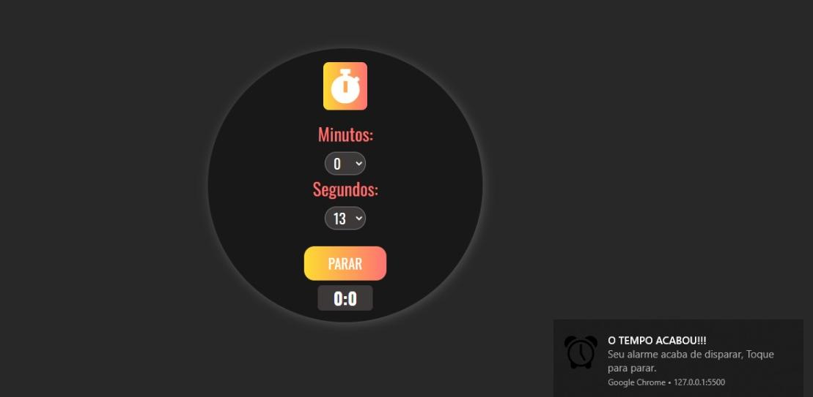

#  :hourglass_flowing_sand: **`Temporizador`** :hourglass_flowing_sand:
Um simples temporizador desenvolvido com javascript puro.

**[Clique aqui](https://luigi-raynel-dev.github.io/temporizador/) para acessar o site do projeto**

## `DESCRIÇÃO DO PROJETO`:scroll:
Este temporizador permite que você defina um tempo e quando esse tempo acabar irá disparar um som de alarme e será notificado. Além disso ele também possui a possibilidade de parar o alarme quando o mesmo for disparado.
# * 。 • ˚ ˚ ˛ ˚ ˛ • 。* 。° 。* 。 • ˚* 。 • ˚ ˚ ˛ ˚ ˛ • 。* 。° 。* 。 • ˚
### `Imagens do projeto`📷

 ----
# * 。 • ˚ ˚ ˛ ˚ ˛ • 。* 。° 。* 。 • ˚* 。 • ˚ ˚ ˛ ˚ ˛ • 。* 。° 。* 。 • ˚
### `O QUE EU APRENDI COM O PROJETO?` :thinking:
*Aprendi a utilizar a biblioteca de push.notifation para avisar o tempo esgotado via navegador do usuário, elém de praticar e aperfoiçoar minha logica para com a regra de negócio fazendo que assim eu possa evoluir tanto na linguagem javascript, mas também na construção de uma aplicação.*

